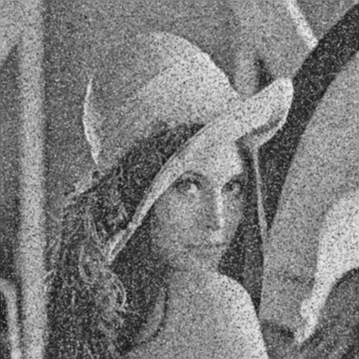
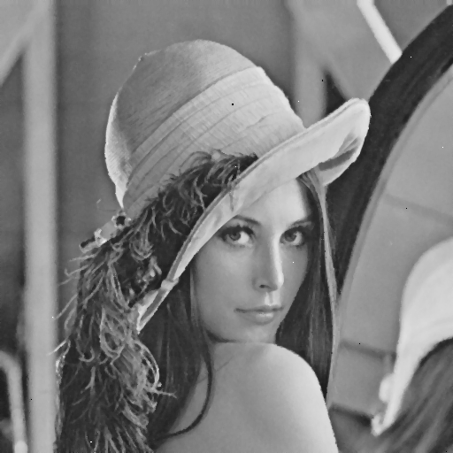
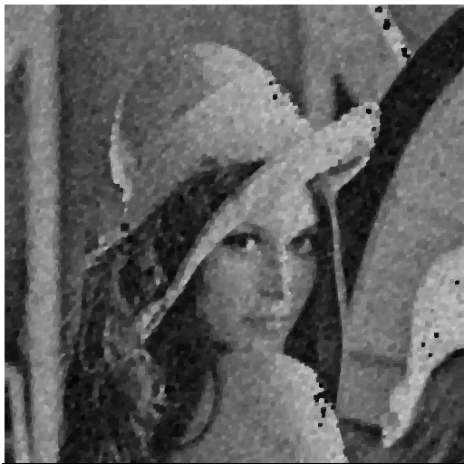
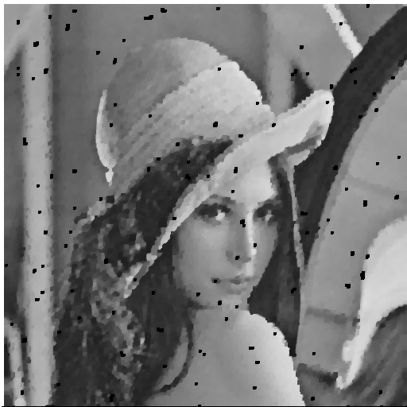

# NTU Computer Vision 

## HW1
### Use B_PIX to write a program to generate
(a)  upside-down lena.im [upsideDown.jpg](hw1/upsideDown.jpg)

(b)  right-side-left lena.im [rightSideLeft.jpg](hw1/rightSideLeft.jpg)

(c)  diagonally mirrored lena.im [diagonallyMirrored.jpg](hw1/diagonallyMirrored.jpg)

***

## HW2
### Write a program to generate:
(a)  a binary image (threshold at 128) [thresholding.jpg](hw2/thresholding.jpg)

(b)  a histogram [lena_histogram.png](hw2/lena_histogram.png) 

(c)  connected components (regions with + at centroid, bounding box) [connectedComponentsLena.jpg](hw2/connectedComponentsLena.jpg) 

*** 

## HW3 
### Write a program to do histogram 
(1)  Before Lena [HistogramEqualization_before.jpg](hw3/HistogramEqualization_before.jpg)

(2)  Before histogram [histogram of lena](hw3/301.png)

(3)  After Lena [HistogramEqualization_after.jpg](hw3/HistogramEqualization_after.jpg)

(4)  After histogram [histogram of lena](hw3/302.png)

***

## HW4
### Write programs which do binary morphological dilation, erosion, opening, closing, and hit-and-miss transform on a binary image
(1)  dilation [Dilation.jpg](hw4/Dilation.jpg)

(2)  erosion [Erosion.jpg](hw4/Erosion.jpg)

(3)  opening [Opening.jpg](hw4/Opening.jpg)

(4)  closing [Closing.jpg](hw4/Closing.jpg)

(5)  hit-and-miss [hitAndMiss.jpg](hw4/hitAndMiss.jpg)

***

## HW5

### Write programs which do gray scale morphological dilation, erosion, opening, and
closing on a gray scale image

(1)  dilation_gray [Dilation_gray.jpg](hw5/Dilation_gray.jpg)

(2)  erosion_gray [Erosion_gray.jpg](hw5/Erosion_gray.jpg)

(3)  opening_gray [Opening_gray.jpg](hw5/Opening_gray.jpg)

(4)  closing_gray [Closing_gray.jpg](hw5/Closing_gray.jpg)

## HW6

### Write a program to generate Yokoi connectivity number
Down sample lena.bmp from 512*512 to64*64 first.
Sample pixels positions at each 8*8 top-left corner, so everyone will get the same answer .

(1)  Yokoi connectivity number [lena.txt](hw6/lena.txt)

## HW7

### Write a program to generate thinned image.
Down sample lena.bmp from 512*512 to 64*64 first.
Sample pixels positions at each 8*8 top-left corner, so everyone will get the same answer .

(1)  thinned txt [lena.txt](hw7/lena.txt)

(2)  thinned image [thinning.jpg](hw7/thinning.jpg)

# NTU Computer Vision 

## HW8

### Write the following programs
Generate additive white Gaussian noise 
Generate salt-and-pepper noise 
Run box filter (3X3, 5X5) on all noisy images
Run median filter (3X3, 5X5) on all noisy images
Run opening followed by closing or closing followed by opening

(1)  Generate additive white Gaussian noise 

(2)  Generate salt-and-pepper noise

(3)  Run box filter (3X3, 5X5) on all noisy images
Run box filter 3X3

Run box filter 5X5

(4)  Run median filter (3X3, 5X5) on all noisy images
Run median filter 3X3

Run median filter 5X5

(5)  Run opening followed by closing or closing followed by opening
Run opening followed by closing

closing followed by opening

## HW9

### Write programs to generate the following gradient magnitude images
and choose proper thresholds to get the binary edge images:
Roberts operator
Prewitt edge detector
Sobel edge detector
Frei and Chen gradient operator
Kirsch compass operator
Robinson compass operator
Nevatia-Babu 5X5 operator

(1)  Roberts operator

(2)  Prewitt edge detector

(3)  Sobel edge detector

(4)  Frei and Chen gradient operator

(5)  Kirsch compass operator

(6)  Robinson compass operator

(7)  Nevatia-Babu 5X5 operator

