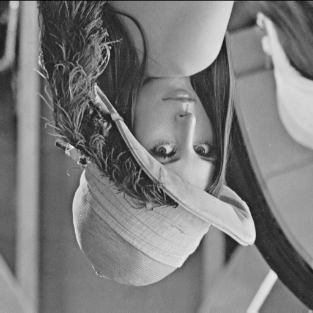
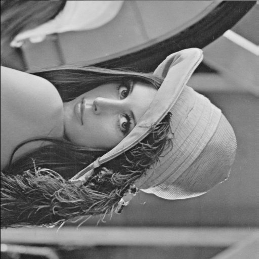

# NTU Computer Vision 

## HW1

### 1. Use B_PIX to write a program to generate

    (a)  upside-down lena.im

    

    (b)  right-side-left lena.im

    

    (c)  diagonally mirrored lena.im

    

