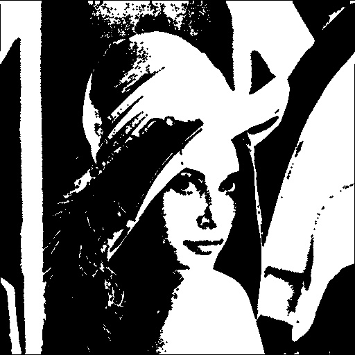
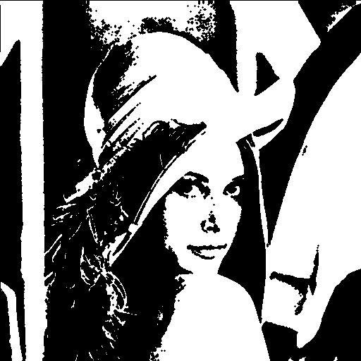
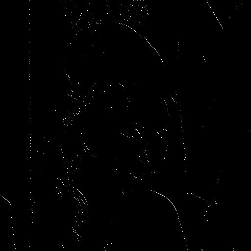

# NTU Computer Vision 

## HW4

### Write programs which do binary morphological dilation, erosion, opening, closing, and hit-and-miss transform on a binary image

(1)  dilation

(2)  erosion

(3)  opening

(4)  closing

(4)  hit-and-miss

