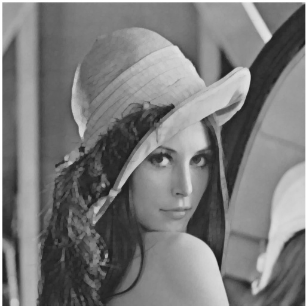

# NTU Computer Vision 

## HW5

### Write programs which do gray scale morphological dilation, erosion, opening, and
closing on a gray scale image

(1)  dilation

(2)  erosion

(3)  opening

(4)  closing

