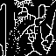

# NTU Computer Vision 

## HW7

### Write a program to generate thinned image.
Down sample lena.bmp from 512*512 to 64*64 first.
Sample pixels positions at each 8*8 top-left corner, so everyone will get the same answer .

(1)  thinned txt

[lena.txt](lena.txt)

(2)  thinned image

