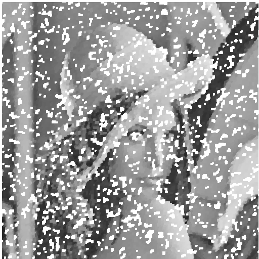
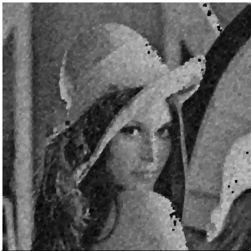
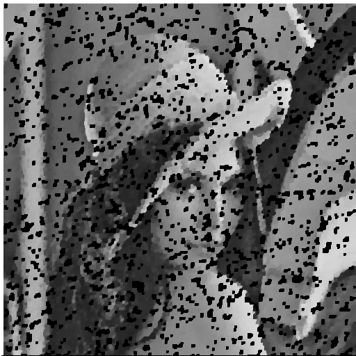

# NTU Computer Vision 

## HW8

### Write the following programs
Generate additive white Gaussian noise 
Generate salt-and-pepper noise 
Run box filter (3X3, 5X5) on all noisy images
Run median filter (3X3, 5X5) on all noisy images
Run opening followed by closing or closing followed by opening

(1)  Generate additive white Gaussian noise 

(2)  Generate salt-and-pepper noise

(3)  Run box filter (3X3, 5X5) on all noisy images
Run box filter 3X3

Run box filter 5X5

(4)  Run median filter (3X3, 5X5) on all noisy images
Run median filter 3X3

Run median filter 5X5

(5)  Run opening followed by closing or closing followed by opening
Run opening followed by closing

closing followed by opening

