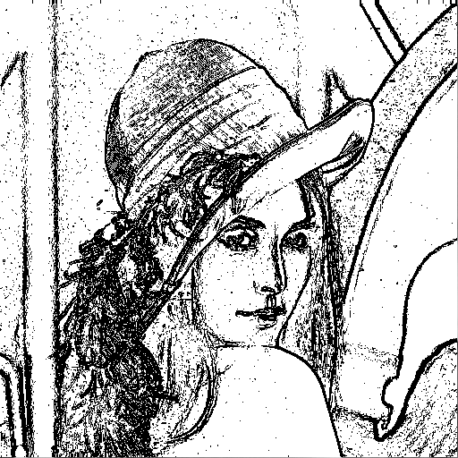
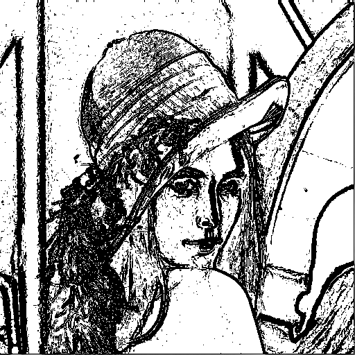
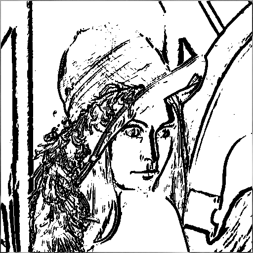

# NTU Computer Vision 

## HW9

### Write programs to generate the following gradient magnitude images
and choose proper thresholds to get the binary edge images:
Roberts operator
Prewitt edge detector
Sobel edge detector
Frei and Chen gradient operator
Kirsch compass operator
Robinson compass operator
Nevatia-Babu 5X5 operator

(1)  Roberts operator

(2)  Prewitt edge detector

(3)  Sobel edge detector

(4)  Frei and Chen gradient operator

(5)  Kirsch compass operator

(6)  Robinson compass operator

(7)  Nevatia-Babu 5X5 operator

